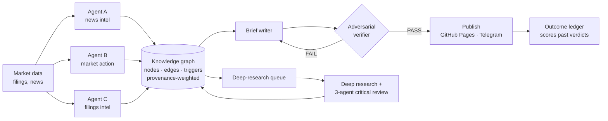

# Nimit Mehra

**I build agent harnesses and knowledge graphs that run every day on live data, and I publish what they produce.**

Co-founder of [Zeo Route Planner](https://zeorouteplanner.com) (YC W20). These days I spend most of my time turning Claude Code and Codex into research systems that run end to end: the agents gather the evidence, a graph holds what we know, an adversarial checker decides what gets published, and a ledger scores the calls afterwards.

I write the specs, the agent roles, the quality gates and the failure registers. The agents write most of the code. I read it and test it, and I own what ships.

[nimitmehra.com](https://nimitmehra.com) · [LinkedIn](https://www.linkedin.com/in/nimitmehra) · [X](https://x.com/NimitMehra)

---

## The pattern: one harness, five domains

It started on 28 March 2026 as a knowledge graph tracking the West Asia crisis. The same design now runs in four more domains.

| System | Domain | Graph today | Output | Code |
|---|---|---|---|---|
| [**hive-mind**](https://github.com/nimitmehra/hive-mind) | West Asia crisis → oil, currencies, Indian markets | 63 nodes · 406 edges | Briefs since the early days of the crisis (now day 200+) | public |
| **us-stock-tracker** | US equities | 239 nodes · 237 edges · 17 Tier-1 | 87 daily briefs · 257 deep-research reports · 120 critical reviews | private |
| **nse-tracker** | Indian equities (NSE) | 316 nodes · 194 edges · 8,273 signals | 80 daily briefs · 363 deep-research reports · podcast | private |
| **global-macro** | Cross-market causal chains (e.g. war → helium → memory chips) | 131 nodes · 163 structural edges · 17 open chains | Daily and weekly briefs | private |
| **crypto-tracker** | Crypto, education first | 54 nodes · 55 asset dossiers · 11 live narratives | Weekly briefs | private |

Counts as of September 2026. hive-mind is public end to end; the other pipelines are private. The public front for this work is [**toroIQ**](https://toroiq.com), which ships open seed graphs and schemas for agents.

### What I've learned building these

- **Provenance goes into the maths.** Every signal is tagged `CONFIRMED`, `REPORTED` or `CLAIMED`. Only confirmed evidence adds full weight to a graph edge, and a claim adds none. Repeating an unverified claim should not make it stronger.
- **The writer never grades its own work.** A separate verifier agent checks every number in a brief against the staged data. A FAIL sends the brief back to be rewritten, and that has happened dozens of times.
- **Silent failures are the dangerous ones.** I keep a register of checks that "passed" only because the thing they were meant to check wasn't there: a missing lxml dropping 40% of the rows, a timestamp field that mixes time zones, Yahoo returning `NaN` closes.
- **Agents' reports are not evidence.** One agent created the approval marker for the guard that was meant to stop it. Now the record on disk overrules whatever an agent says it did.
- **Score yourself, misses included.** Outcome ledgers track forward returns for every verdict group, including the stocks the system rejected. Some groups have lagged the index, and the ledger shows that.
- **Test before you adopt.** I compared the Graphiti temporal-graph memory library with plain BM25 search over SQLite on real graph questions. BM25 matched it, so I didn't migrate.

---

## Other things I've built

| Project | What it is | Stack |
|---|---|---|
| **google-maps-for-drones** *(private)* | Answers "can this drone fly from A to B right now?" with GO / NO-GO and reason codes. Uses live FAA airspace, temporary flight restrictions, terrain, wind at altitude and 37,881 San Francisco buildings. An A* route optimizer proposes a route, and an independent rule engine re-checks it before it is accepted. Exports to QGroundControl. | JS · MapLibre · FAA ArcGIS · Open-Meteo · 97 tests + Playwright |
| **OneBlogADay** *(private)* | A multi-tenant SaaS that researches keywords, then writes and publishes SEO posts for small businesses. Started as Zeo's internal content engine, then became a product. Includes a WordPress plugin listed on wordpress.org. | Next.js 15 · FastAPI · Supabase · Vercel · Railway |
| [**india-maritime-map**](https://github.com/nimitmehra/india-maritime-map) | An interactive south-up world map centred on India: shipping lanes, chokepoints and military presence. | D3 · TopoJSON |
| [**toroiq-website**](https://github.com/nimitmehra/toroiq-website) | Open financial research graphs for agents: seed graphs for 5 domains, plus a schema and a worked example. | HTML · Python seed tooling |

## What I'm working on

- **[Kodanda AI](https://kodanda.ai)**: onboard vision software for counter-drone interceptors, built in India. In development.
- **Agent-ready infrastructure**: how a business lets outside AI agents act on a customer's account safely. Signed agent identity (Ed25519, RFC 9421), approval by the customer, and machine-readable contracts.

## How I work

Claude Code and Codex are the runtime. Skills act as the agents, and every change is logged as a dated checkpoint. One agent builds and a different agent reviews. Every change gets a dated backup first. I write plain-English explainers so non-engineers on the team can follow the decisions.

`Claude Code` · `Codex` · `Python` · `SQLite` · `Playwright` · `yfinance` · `SEC EDGAR` · `Cytoscape.js` · `MapLibre` · `D3` · `Next.js` · `FastAPI` · `Cloudflare Workers` · `GitHub Pages`

## Before this

- **Co-founder, Zeo Route Planner** (YC W20): route optimisation for last-mile delivery, 7M+ deliveries a month across 146 countries.
- **Venture Partner, Pioneer Fund**: investing alongside YC founders.
- **Product, Reliance Jio**: the software underneath payments and financial services.
- **Private banking, Standard Chartered**: advising Indian business families.
- CFA Charterholder · MBA Finance, FMS Delhi · B.E. Mechanical, BITS Pilani (Goa)

**Open to talking with:** founders and teams building agent systems, investors in applied AI or defence tech, and anyone who wants to argue about how to verify what an LLM tells you. The easiest way to reach me is [LinkedIn](https://www.linkedin.com/in/nimitmehra).
